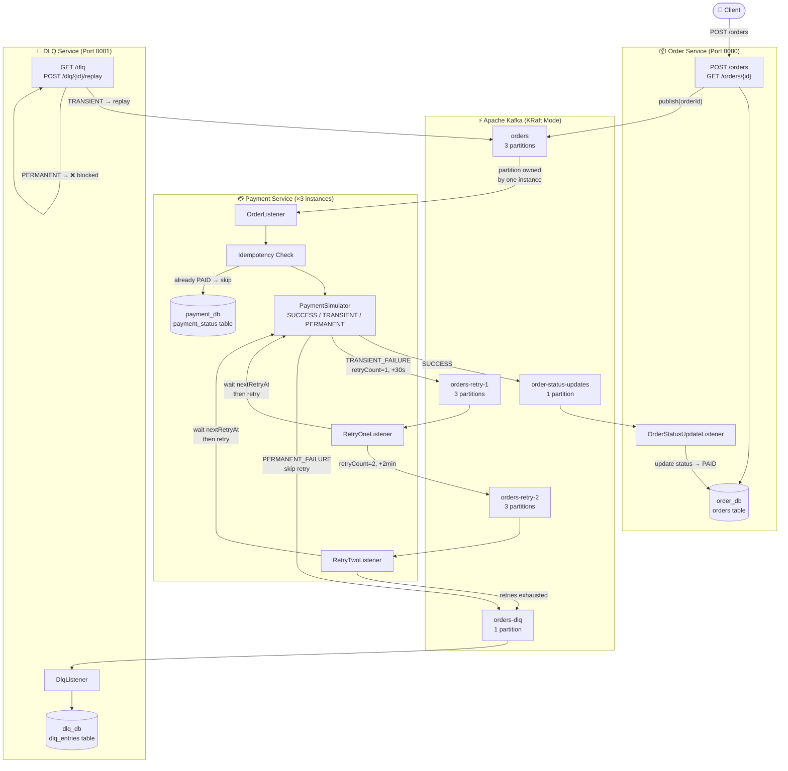
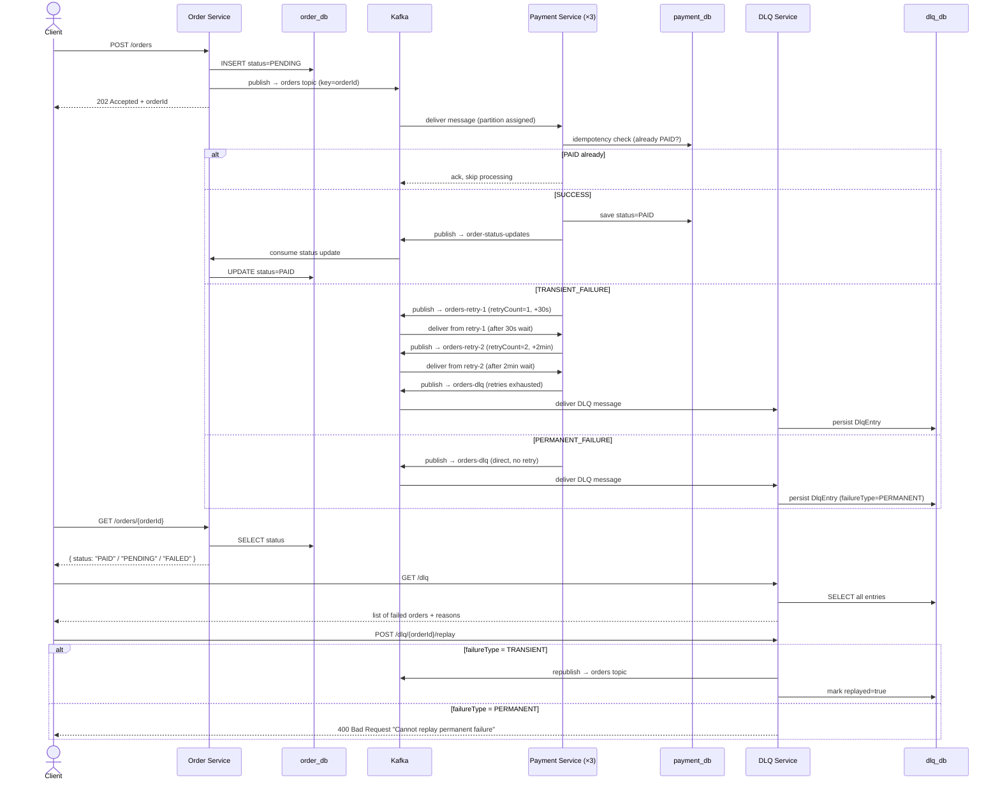

<div align="center">

# ⚡ Kafka Order Processing System

### Event-driven order processing backend — Spring Boot, Apache Kafka, MySQL & Docker


</div>

---

## Overview

The Kafka Order Processing System is a three-service, event-driven order pipeline that simulates the backbone of a real e-commerce checkout — order intake, asynchronous payment processing, automatic retry with backoff, and dead-letter recovery — using Apache Kafka as the only channel of communication between services.

The project was built to demonstrate distributed-systems backend depth — specifically Kafka partitioning, consumer group rebalancing, at-least-once delivery with idempotent consumers, and multi-topic retry patterns — using Java 21, Spring Boot 4, and MySQL, fully containerized with Docker Compose.

Unlike a typical REST-chained microservice setup, none of the three services ever call each other directly. `order-service`, `payment-service`, and `dlq-service` communicate exclusively by publishing to and consuming from Kafka topics.

---

## 🔗 Live Demo

| Service | URL |
|---|---|
| Order Service API | *Not deployed — local Docker Compose only* |
| DLQ Service API | *Not deployed — local Docker Compose only* |
| Kafka UI | `http://localhost:8090` (local only) |

---

## Key Features

### Core Order Features
- REST API to place an order — persisted as `PENDING` immediately, `202 Accepted` returned in milliseconds
- Order status polling via `GET /orders/{id}`, updated purely from Kafka events — no synchronous calls to payment-service

### Reliability & Fault-Tolerance Features
- Consumer group parallelism — 3 payment-service instances, each owning a Kafka partition, processing orders in parallel
- Live partition rebalancing — kill an instance and Kafka redistributes its partition automatically
- Transient vs. permanent failure detection — retryable gateway timeouts vs. fatal errors like an invalid card
- Multi-topic retry with exponential backoff — `orders-retry-1` (30s) → `orders-retry-2` (2min)
- Direct DLQ routing for permanent failures — no wasted retry cycles
- Idempotent consumers — payment-service checks existing status before charging, safe against Kafka's at-least-once redelivery

### Operational Features
- DLQ persistence with full failure reason, failure type, and retry history
- Manual DLQ replay — TRANSIENT failures can be republished; PERMANENT failures are blocked until root cause is fixed
- Dockerized deployment — single `docker-compose up` boots Kafka (KRaft), MySQL, Kafka UI, and all three services

---

## Tech Stack

### Backend
| Technology | Purpose |
|---|---|
| Java 21 | Core language (records, pattern matching) |
| Spring Boot 4.0 | Application framework |
| Spring Kafka | Producer/consumer auto-configuration |
| Spring Data JPA / Hibernate | ORM and database access |
| Lombok | Boilerplate reduction |
| Maven | Build and dependency management |

### Messaging
| Technology | Purpose |
|---|---|
| Apache Kafka (KRaft mode) | Event backbone — no Zookeeper |
| Kafka headers | Retry metadata (`retryCount`, `nextRetryAt`, `failureType`, `failureReason`) |

### Database
| Technology | Purpose |
|---|---|
| MySQL 8.0 | One database per service (`order_db`, `payment_db`, `dlq_db`) |

### Deployment & Monitoring
| Technology | Purpose |
|---|---|
| Docker Compose | Multi-container local orchestration |
| Kafka UI (provectus) | Topic, consumer group, and rebalancing visibility |

---

## System Architecture



### Sequence Diagram



---

## How The System Works

### 1. Order Placement
A client sends `POST /orders`. Order Service generates a UUID `orderId`, writes a `PENDING` row to `order_db`, publishes an `OrderMessage` to the `orders` topic keyed by `orderId`, and returns `202 Accepted` immediately — no waiting on payment.

### 2. Kafka Delivery & Idempotency Check
One of three payment-service instances owns the partition the `orderId` hashed to. Before charging, it checks `payment_db` for an existing `PAID` row for that order:

```java
Optional<PaymentStatus> existing =
    paymentStatusRepository.findByOrderIdAndStatus(orderId, PAID);
if (existing.isPresent()) {
    return; // already processed — ack and skip, prevents double-charge
}
```

This guard is what makes the consumer safe against Kafka's at-least-once redelivery guarantee.

### 3. Transient Failure → Retry Topics
If `PaymentSimulator` returns `TRANSIENT_FAILURE` (e.g. gateway timeout), the message is stamped with `retryCount=1` and `nextRetryAt = now + 30s`, then republished to `orders-retry-1`. The retry listener reads the header and sleeps until that timestamp before reprocessing:

```java
long nextRetryAt = KafkaHeaderUtil.getNextRetryAt(record.headers());
long delay = nextRetryAt - System.currentTimeMillis();
if (delay > 0) Thread.sleep(delay);
```

A second failure escalates to `orders-retry-2` with a 2-minute delay. This sleep-based pattern is deliberately confined to the low-volume retry topics — using it on the main `orders` topic would stall the whole consumer thread.

### 4. Permanent Failure → Direct DLQ
If the simulator returns `PERMANENT_FAILURE` (e.g. invalid card), the message skips all retry topics and is published straight to `orders-dlq`. Retrying a permanent failure wastes retry capacity and delays visibility into a real problem.

### 5. DLQ Review & Replay
`dlq-service` persists every failed order with its full payload, failure type, reason, and retry history. A human reviews `GET /dlq`, then calls `POST /dlq/{orderId}/replay`. TRANSIENT entries are republished to `orders` with a fresh retry count; PERMANENT entries are blocked until the underlying issue is fixed.

### 6. Order Status Tracking
On success, payment-service publishes to `order-status-updates`. Order Service's listener consumes this and flips the order to `PAID` in `order_db`. `GET /orders/{id}` always reads this local, already-updated row — it never polls payment-service directly.

---

## Kafka Topics & Retry Headers

| Topic | Partitions | Key | Purpose |
|---|---|---|---|
| `orders` | 3 | orderId | New order intake |
| `orders-retry-1` | 3 | orderId | First retry, 30s backoff |
| `orders-retry-2` | 3 | orderId | Second retry, 2min backoff |
| `orders-dlq` | 1 | orderId | Exhausted retries + permanent failures |
| `order-status-updates` | 1 | orderId | Outcome events back to order-service |

> Using `orderId` as the message key guarantees all messages for one order land on the same partition and are processed in order by the same consumer instance.

| Header | Type | Description |
|---|---|---|
| `retryCount` | int | Current retry attempt (0, 1, 2) |
| `nextRetryAt` | timestamp | Epoch millis — consumer waits until this time |
| `failureType` | string | `TRANSIENT_FAILURE` or `PERMANENT_FAILURE` |
| `failureReason` | string | Human-readable reason |

Retry metadata lives entirely in Kafka headers, not the JSON payload — the business object (`OrderMessage`) stays unchanged throughout its lifecycle.

---

## Database Schema

### `order_db` → `orders` *(Order Service)*
| Column | Type | Notes |
|---|---|---|
| `order_id` | VARCHAR(36) | UUID, Primary Key |
| `status` | ENUM | PENDING, PAID, FAILED |
| `created_at` | DATETIME | Set on insert |
| `updated_at` | DATETIME | Updated on every status change |

### `payment_db` → `payment_status` *(Payment Service)*
| Column | Type | Notes |
|---|---|---|
| `order_id` | VARCHAR(36) | UUID, Primary Key |
| `status` | ENUM | PENDING, PAID, FAILED |
| `updated_at` | DATETIME | Last processing attempt |

> This table is the idempotency guard — checked before every charge attempt.

### `dlq_db` → `dlq_entries` *(DLQ Service)*
| Column | Type | Notes |
|---|---|---|
| `id` | BIGINT | Auto-increment PK |
| `order_id` | VARCHAR(36) | The failed orderId |
| `payload` | TEXT | Full original OrderMessage as JSON |
| `failure_type` | VARCHAR(30) | TRANSIENT_FAILURE / PERMANENT_FAILURE |
| `failure_reason` | VARCHAR(255) | Human-readable reason |
| `retry_history` | TEXT | Log of retry attempts and timestamps |
| `replayed` | BOOLEAN | Whether replayed |
| `created_at` | DATETIME | Arrival time in DLQ |

---

## 🐳 Deployment Architecture & Techniques

### Containerization with Docker Compose
All three services, plus Kafka (KRaft mode), MySQL, and Kafka UI, run as a single `docker-compose` stack. This avoids manual service-discovery or hostname wiring — Kafka is the only integration point between containers.

```bash
docker-compose up --build
docker-compose up --build --scale payment-service=3
```

### KRaft Mode (No Zookeeper)
Kafka runs in KRaft mode, removing the Zookeeper container entirely. This drops the infra footprint from two containers to one, simplifies startup ordering, and reflects the direction the Kafka project has moved since 3.x.

### Environment-Based Configuration
> **Gap to close:** unlike FinFlow, this project's `application.yml` files don't currently show DB credentials or Kafka bootstrap servers being injected via environment variables at container runtime. Recommended pattern to add:

```yaml
spring.datasource.url=jdbc:mysql://${MYSQLHOST}:${MYSQLPORT}/${MYSQLDATABASE}
spring.datasource.username=${MYSQLUSER}
spring.datasource.password=${MYSQLPASSWORD}
spring.kafka.bootstrap-servers=${KAFKA_BOOTSTRAP_SERVERS}
```

### Monitoring
Kafka UI (`provectus/kafka-ui`) is included in the compose stack for topic, partition, consumer-group, and lag visibility — the primary way to *see* rebalancing and retry behavior happen live.

### CI/CD
Not yet set up. GitHub Actions (build + test on push) is tracked in [Future Improvements](#-future-improvements) — same gap FinFlow had solved via Render's auto-deploy-on-push.

---

## API Reference

### Order Service — `http://localhost:8080`
```
POST /orders              Place a new order → 202 Accepted
GET  /orders/{orderId}    Poll current order status
```

**POST /orders**
```json
{ "customerId": "cust-123", "amount": 250.00, "items": ["item-a", "item-b"] }
```
```json
{ "orderId": "f47ac10b-58cc-4372-a567-0e02b2c3d479", "status": "PENDING" }
```

**GET /orders/{orderId}**
```json
{
  "orderId": "f47ac10b-58cc-4372-a567-0e02b2c3d479",
  "status": "PAID",
  "createdAt": "2025-01-15T10:23:45",
  "updatedAt": "2025-01-15T10:23:52"
}
```

### DLQ Service — `http://localhost:8081`
```
GET  /dlq                     List all failed orders
POST /dlq/{orderId}/replay    Replay a TRANSIENT failure
```

**POST /dlq/{orderId}/replay**
```json
{ "message": "Order f47ac10b-... replayed successfully" }
```
```json
{ "error": "Cannot replay a permanent failure. Resolve the root cause first." }
```

---

## Project Structure

```
kafka-order-system/
│
├── docker-compose.yml
├── mysql-init/init-db.sql
├── create-topics.sh
│
├── order-service/         → REST intake, orders table, status listener
├── payment-service/       → Kafka consumers, PaymentSimulator, idempotency, retry listeners
└── dlq-service/           → DLQ listener, replay controller, dlq_entries table
```

*(Full per-service package breakdown unchanged from the original — see repo.)*

---

## ⚙️ Setup Instructions

### Prerequisites
- Java 21+
- Docker Desktop
- Maven 3.9+

### Backend (Local)
```bash
git clone https://github.com/yourusername/kafka-order-system.git
cd kafka-order-system

docker-compose up -d kafka mysql kafka-ui
chmod +x create-topics.sh
./create-topics.sh
```
Verify topics at `http://localhost:8090`, then run each `*Application.java` in IntelliJ:

| Service | Port | Notes |
|---|---|---|
| OrderServiceApplication | 8080 | Start first |
| PaymentServiceApplication | none | Kafka only |
| DlqServiceApplication | 8081 | Start after payment-service |

### Backend (Docker, full stack)
```bash
docker-compose up --build --scale payment-service=3
```

### Test the Happy Path
```bash
curl -X POST http://localhost:8080/orders \
  -H "Content-Type: application/json" \
  -d '{"customerId": "cust-1", "amount": 250.0, "items": ["item-a"]}'

curl http://localhost:8080/orders/{orderId}
curl http://localhost:8081/dlq
curl -X POST http://localhost:8081/dlq/{orderId}/replay
```

---

## 📸 Screenshots

| | |
|---|---|
| **Kafka UI — Topics Overview** | **Kafka UI — Consumer Group (3 members)** |
|  |  |
| **Kafka UI — Live Rebalancing** | **Postman — POST /orders** |
|  |  |

---


## Key Learnings

- **Event-driven decoupling** eliminates network coupling and synchronous failure propagation between services.
- **Partitions are the unit of parallelism** — a consumer group with N members owns at most 1 partition each; more consumers than partitions adds nothing.
- **Rebalancing** briefly pauses assignment when a consumer joins/leaves; idempotency handles the edge case of a message mid-processing during that pause.
- **At-least-once + idempotent consumers** is the practical alternative to Kafka exactly-once transactions.
- **Multi-topic retry** (vs. in-memory sleep/loop) means retries survive restarts, are visible in monitoring, and are independently tunable per stage.
- **A DLQ is an operational tool**, not a dumping ground — it needs enough context to make a replay decision without digging through logs.

---

## Conclusion

This project demonstrates the distributed-systems side of backend engineering — Kafka partitioning, consumer group rebalancing, idempotent event processing, and a multi-stage retry/DLQ pattern — the kind of fault-tolerance thinking that real order-processing pipelines depend on. The core mechanics (retry backoff, transient/permanent failure routing, DLQ replay) are fully implemented end-to-end. The clearest next steps to bring it to FinFlow's level of production polish are closing the authentication gap, backing the reliability claims with recorded test evidence, and standing up a live deployment.


