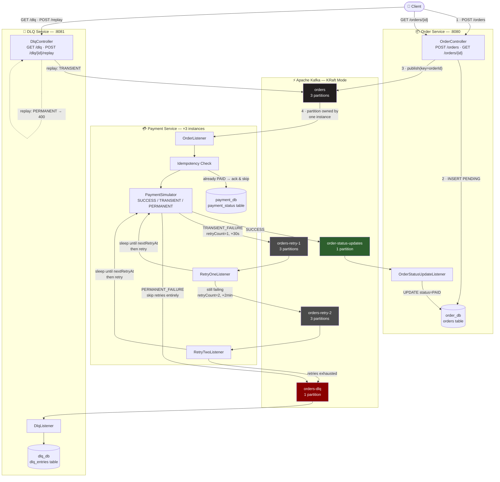
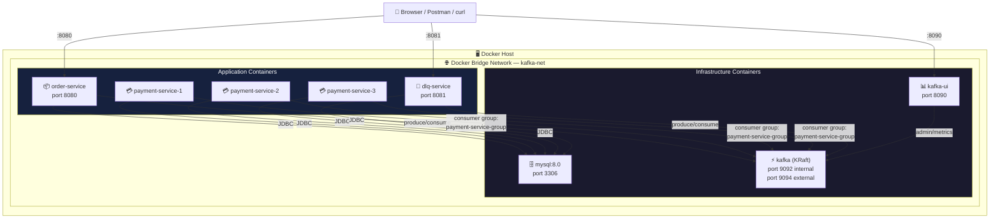
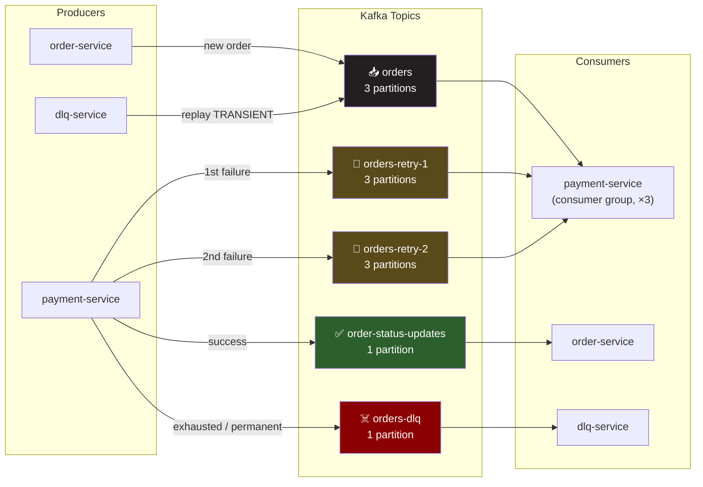
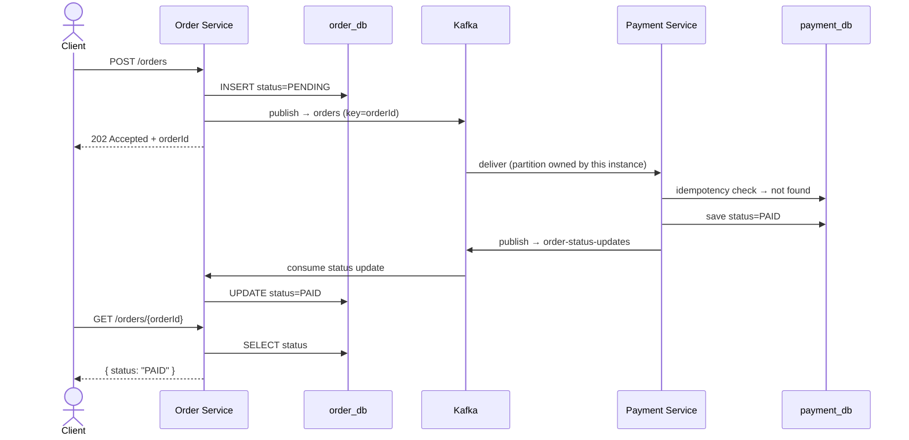
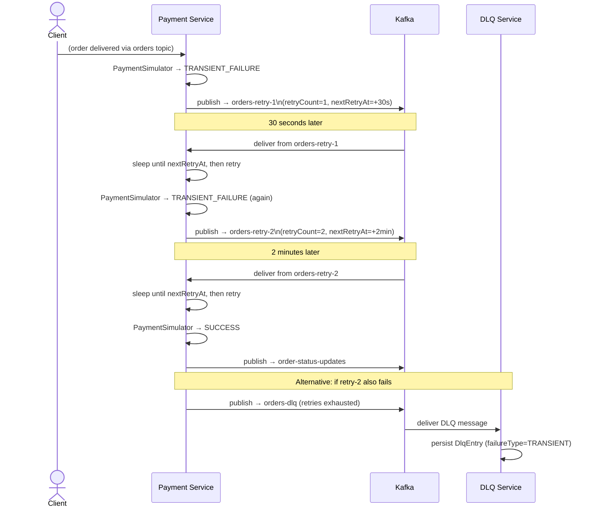
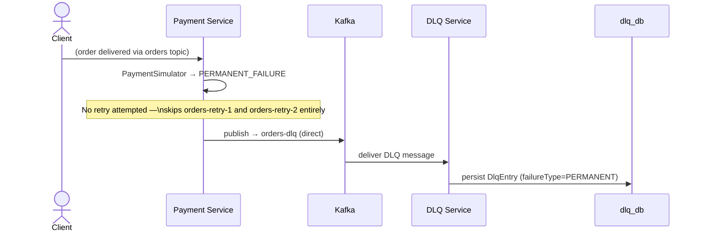
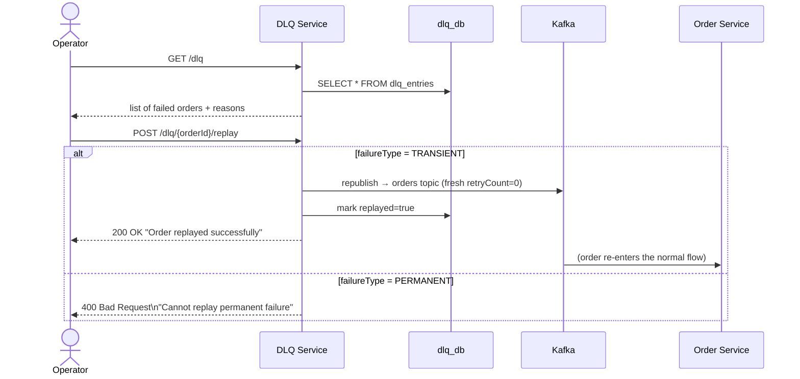
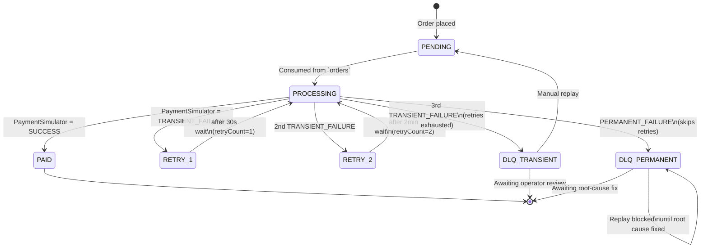
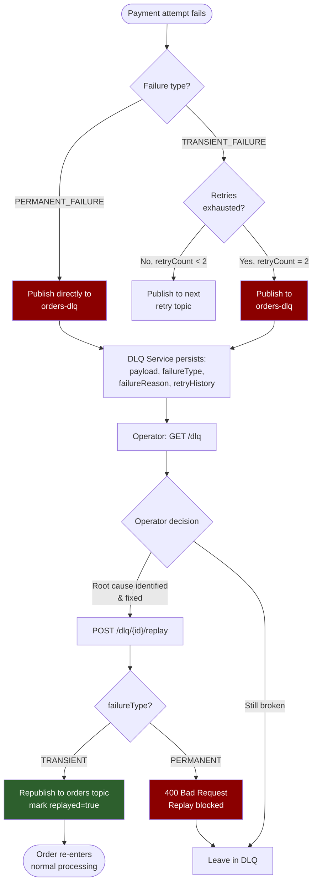
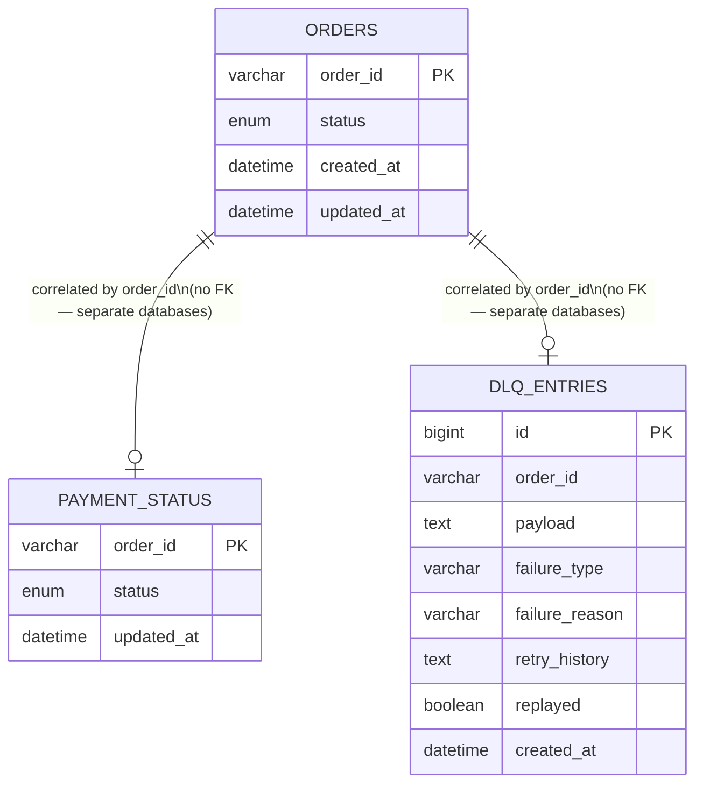

<div align="center">

# ⚡ Kafka Order Processing System

### An event-driven order pipeline built to demonstrate distributed-systems backend engineering

**Kafka partitioning · Consumer group rebalancing · At-least-once delivery · Idempotent consumers · Multi-stage retry · Dead Letter Queue**


[Overview](#-overview) •
[Architecture](#-system-architecture) •
[Kafka Flow](#-detailed-request-flow) •
[Design Decisions](#-design-decisions--trade-offs) •
[API Docs](#-api-reference) •
[Setup](#%EF%B8%8F-setup--installation) •
[Learnings](#-key-learnings)

</div>

---

## 📋 Table of Contents

- [Overview](#-overview)
- [Why This Project Exists](#-why-this-project-exists)
- [Live Demo](#-live-demo)
- [Key Features](#-key-features)
- [Tech Stack](#-tech-stack)
- [System Architecture](#-system-architecture)
  - [Logical Architecture](#logical-architecture)
  - [Deployment / Container Architecture](#deployment--container-architecture)
  - [Kafka Topic Topology](#kafka-topic-topology)
  - [Docker Network View](#docker-network-view)
- [Detailed Request Flow](#-detailed-request-flow)
- [Sequence Diagrams](#-sequence-diagrams)
- [Retry Mechanism Deep Dive](#-retry-mechanism-deep-dive)
- [Dead Letter Queue Deep Dive](#-dead-letter-queue-deep-dive)
- [Design Decisions & Trade-offs](#-design-decisions--trade-offs)
- [Database Schema](#-database-schema)
- [Kafka Topics & Headers Reference](#-kafka-topics--headers-reference)
- [API Reference](#-api-reference)
- [Idempotency & Fault Tolerance](#-idempotency--fault-tolerance)
- [Failure Scenario Matrix](#-failure-scenario-matrix)
- [Project Structure](#-project-structure)
- [Setup & Installation](#%EF%B8%8F-setup--installation)
- [Testing the System](#-testing-the-system)
- [Monitoring & Observability](#-monitoring--observability)
- [Screenshots](#-screenshots)
- [Production Readiness Checklist](#-production-readiness-checklist)
- [Future Improvements](#-future-improvements)
- [Key Learnings](#-key-learnings)
- [Conclusion](#-conclusion)
- [License](#-license)

---

## 🧭 Overview

The **Kafka Order Processing System** is a three-service, event-driven order pipeline that simulates the backbone of a real e-commerce checkout: order intake, asynchronous payment processing, automatic retry with backoff, and dead-letter recovery — using **Apache Kafka as the only channel of communication between services.**

Instead of chaining synchronous REST calls between an order service and a payment service ,every business event here is a message on a Kafka topic. That single decision cascades into everything interesting about this project: services can fail independently without cascading failure, payment processing can be scaled horizontally just by adding consumer instances, and every event is durable and replayable instead of being lost the moment a synchronous call times out.

The project consists of **three independently deployable Spring Boot microservices**, each with its own database, each unaware of the others' existence except through Kafka topic contracts:

| Service | Responsibility | Owns |
|---|---|---|
| `order-service` | Accepts orders, exposes status | `order_db` |
| `payment-service` | Simulates payment processing, retries, idempotency | `payment_db` |
| `dlq-service` | Captures permanent/exhausted failures, exposes replay | `dlq_db` |

No service ever calls another service's REST API. If `payment-service` is completely down, `order-service` keeps accepting orders — they simply queue up in Kafka until a consumer comes back online. That property, more than any single line of code, is the point of the project.

---

## 🎯 Why This Project Exists

Most portfolio backend projects demonstrate CRUD over REST. This project was built specifically to demonstrate the parts of backend engineering that only show up once a system has to survive **partial failure at scale**:

- What happens when a downstream service is *temporarily* unavailable, versus *permanently* rejecting the request?
- How do you retry safely without either hammering a failing dependency or losing the message?
- How do you guarantee a customer is never charged twice when your message broker only guarantees *at-least-once* delivery?
- How do you scale a consumer horizontally, and what actually happens on the wire when you do?
- Where do failed events go when retries are exhausted, and how does a human safely intervene?

Every architectural choice in this repository — database-per-service, retry topics instead of an in-memory loop, DLQ with a replay gate, idempotency keyed off business state rather than message IDs — exists to answer one of those questions concretely, not theoretically.

---

## 🔗 Live Demo

| Service | URL | Status |
|---|---|---|
| Order Service API | — | *Not deployed — local Docker Compose only* |
| DLQ Service API | — | *Not deployed — local Docker Compose only* |
| Kafka UI | `http://localhost:8090` | Local only |

> This is intentionally a local-first, infrastructure-heavy project (Kafka + MySQL + 3 services). See [Future Improvements](#-future-improvements) for the plan to get a cloud-hosted demo running.

---

## ✨ Key Features

### Core Order Features
-  REST API to place an order — persisted as `PENDING` immediately, `202 Accepted` returned in milliseconds, with zero synchronous dependency on payment processing
-  Order status polling via `GET /orders/{id}`, updated purely from Kafka events consumed asynchronously — never a live call to `payment-service`
-  Order and payment records correlated end-to-end by a single `orderId` UUID used as both the primary key and the Kafka partition key

### Reliability & Fault-Tolerance Features
-  **Consumer group parallelism** — up to 3 `payment-service` instances, each owning a distinct Kafka partition, processing orders truly in parallel
-  **Live partition rebalancing** — kill an instance mid-flight and Kafka redistributes its partition to a surviving consumer automatically, with zero message loss
-  **Transient vs. permanent failure classification** — retryable errors (gateway timeout, network blip) are routed differently from fatal errors (invalid card, fraud block)
-  **Multi-topic retry with exponential-style backoff** — `orders-retry-1` (30s) → `orders-retry-2` (2 min), each an isolated Kafka topic rather than an in-memory retry loop
-  **Direct DLQ routing for permanent failures** — no wasted retry cycles on errors that will never succeed
-  **Idempotent consumers** — `payment-service` checks existing payment status before charging, making it safe against Kafka's at-least-once redelivery guarantee

### Operational Features
- 📂 DLQ persistence with full original payload, failure type, human-readable failure reason, and retry history
- 🔁 Manual DLQ replay endpoint — `TRANSIENT_FAILURE` entries can be safely republished; `PERMANENT_FAILURE` entries are blocked at the API level until the root cause is fixed
- 🐳 Fully Dockerized deployment — a single `docker-compose up` boots Kafka (KRaft mode), MySQL, Kafka UI, and all three services
- 📊 Kafka UI included out of the box for live topic, partition, consumer-group, and lag visibility
- 🏗️ Multi-stage Docker builds per service — no Maven or JDK required on the host machine to run the stack

---

## 🧱 Tech Stack

### Backend
| Technology | Version | Purpose |
|---|---|---|
| Java | 21 | Core language — records, pattern matching, virtual-thread-ready |
| Spring Boot | 3.0 | Application framework, embedded Tomcat, auto-configuration |
| Spring Kafka | latest | Producer/consumer auto-configuration, `@KafkaListener` |
| Spring Data JPA / Hibernate | latest | ORM and database access per service |
| Lombok | latest | Boilerplate reduction (`@Data`, `@Builder`, etc.) |
| Maven | 3.9+ | Build and dependency management |

### Messaging
| Technology | Purpose |
|---|---|
| Apache Kafka (KRaft mode) | Event backbone — no ZooKeeper dependency |
| Kafka Headers | Carries retry metadata (`retryCount`, `nextRetryAt`, `failureType`, `failureReason`) out-of-band from the business payload |

### Database
| Technology | Purpose |
|---|---|
| MySQL 8.0 | One dedicated schema per service — `order_db`, `payment_db`, `dlq_db` |

### Deployment & Monitoring
| Technology | Purpose |
|---|---|
| Docker | Multi-stage image builds per service |
| Docker Compose | Single-command orchestration of the full stack |
| Kafka UI (provectus) | Topic, partition, consumer-group, and rebalance visibility |

---

## 🏛️ System Architecture

### Logical Architecture

This view shows *what talks to what* — the data plane of the system, independent of how it's containerized.



**Key property visible in this diagram:** every arrow leaving `order-service`, `payment-service`, and `dlq-service` terminates at Kafka — never at another service. That's not a stylistic choice; it's enforced by the fact that none of the three services declare an HTTP client for any other service in the stack.

---

### Deployment / Container Architecture

This view shows *how the system is packaged and run* — the infrastructure plane.



Each of the three `payment-service` replicas is the **same image**, scaled via `docker-compose up --scale payment-service=3`. Kafka's consumer group protocol — not application code — is what decides which replica owns which partition, and rebalances automatically when a replica joins or leaves.

---

### Kafka Topic Topology



Every topic that carries an order (`orders`, `orders-retry-1`, `orders-retry-2`) is keyed by `orderId` and partitioned identically (3 partitions), which guarantees that **all messages for a given order are processed by the same consumer instance, in order**, regardless of which retry stage they're in.

---

### Docker Network View

```text
                         Docker Bridge Network: kafka-net
        ┌──────────────────────────────────────────────────────────────┐
        │                                                              │
        │   ┌─────────┐        ┌───────────────┐       ┌───────────┐   │
        │   │  MySQL  │◄──────►│  order-service │◄─────►│   Kafka   │   │
        │   │  :3306  │        │     :8080      │       │ (KRaft)   │   │
        │   └─────────┘        └───────────────┘       │  :9092    │   │
        │        ▲                                     │  :9094    │   │
        │        │              ┌───────────────┐      └─────┬─────┘   │
        │        ├─────────────►│payment-service│◄───────────┤         │
        │        │              │  (×3 replicas) │            │         │
        │        │              └───────────────┘            │         │
        │        │                                            │         │
        │        │              ┌───────────────┐             │         │
        │        └─────────────►│  dlq-service  │◄────────────┤         │
        │                       │     :8081      │            │         │
        │                       └───────────────┘            │         │
        │                                                     │         │
        │                       ┌───────────────┐             │         │
        │                       │   Kafka UI     │◄────────────┘         │
        │                       │     :8090      │                      │
        │                       └───────────────┘                      │
        └──────────────────────────────────────────────────────────────┘
                       │              │              │
                   :8080 (host)   :8081 (host)   :8090 (host)
```

---

## 🔬 Detailed Request Flow

### 1. Order Placement
A client sends `POST /orders`. `order-service`:
1. Generates a UUID `orderId`
2. Writes a `PENDING` row to `order_db`
3. Publishes an `OrderMessage` to the `orders` topic, **keyed by `orderId`**
4. Returns `202 Accepted` immediately — there is no synchronous wait on payment processing

### 2. Kafka Delivery & Partition Assignment
Because `orders` has 3 partitions and `orderId` is used as the message key, Kafka's default partitioner hashes the key to deterministically assign the message to one partition. One of the (up to) 3 `payment-service` replicas in the consumer group owns that partition and receives the message — no other replica will ever see it.

### 3. Idempotency Check
Before attempting to charge, the owning `payment-service` instance queries `payment_db` for an existing `PAID` record for that `orderId`:

```java
Optional<PaymentStatus> existing =
    paymentStatusRepository.findByOrderIdAndStatus(orderId, PAID);
if (existing.isPresent()) {
    return; // already processed — ack and skip, prevents double-charge
}
```

This single check is what makes the consumer safe against Kafka's **at-least-once** delivery guarantee — if the same message is redelivered after a rebalance or consumer restart, the customer is never charged twice.

### 4. Success Path
If `PaymentSimulator` returns `SUCCESS`, `payment-service`:
1. Writes `PAID` to `payment_db`
2. Publishes to `order-status-updates`
3. `order-service`'s `OrderStatusUpdateListener` consumes the event and updates `order_db` to `PAID`

### 5. Transient Failure → Retry Topics
If the simulator returns `TRANSIENT_FAILURE` (e.g. gateway timeout), the message is stamped with `retryCount=1` and `nextRetryAt = now + 30s` as **Kafka headers**, then republished to `orders-retry-1`. The retry listener reads the header and sleeps until that timestamp before reprocessing:

```java
long nextRetryAt = KafkaHeaderUtil.getNextRetryAt(record.headers());
long delay = nextRetryAt - System.currentTimeMillis();
if (delay > 0) Thread.sleep(delay);
```

A second failure escalates to `orders-retry-2` with a 2-minute delay. This sleep-based wait is deliberately confined to the low-volume retry topics — applying the same pattern to the main `orders` topic would stall the whole consumer thread and block healthy orders behind a slow retry.

### 6. Permanent Failure → Direct DLQ
If the simulator returns `PERMANENT_FAILURE` (e.g. invalid card, fraud rule triggered), the message skips every retry topic and is published straight to `orders-dlq`. Retrying a permanent failure only wastes retry capacity and delays visibility into a real problem — so it isn't attempted.

### 7. DLQ Review & Replay
`dlq-service` persists every failed order with its full payload, failure type, reason, and retry history. A human reviews `GET /dlq`, then calls `POST /dlq/{orderId}/replay`:
- `TRANSIENT_FAILURE` entries are republished to `orders` with a fresh retry count
- `PERMANENT_FAILURE` entries are **rejected at the API level** with `400 Bad Request` until the underlying issue is fixed

### 8. Order Status Tracking
`GET /orders/{id}` always reads the local, already-updated row in `order_db` — it never polls `payment-service` directly, and never blocks on Kafka.

---

## 🔀 Sequence Diagrams

### Happy Path



### Transient Failure → Retry → Recovery



### Permanent Failure — Direct to DLQ



### DLQ Replay Flow



---

## 🔁 Retry Mechanism Deep Dive

### Retry State Diagram



### Backoff Table

| Attempt | Topic | Wait Before Processing | Header Stamped |
|---|---|---|---|
| 1st failure | `orders-retry-1` | 30 seconds | `retryCount=1`, `nextRetryAt=now+30s` |
| 2nd failure | `orders-retry-2` | 2 minutes | `retryCount=2`, `nextRetryAt=now+2min` |
| 3rd failure | `orders-dlq` | — (terminal) | `failureType=TRANSIENT_FAILURE`, full retry history |

### Why Kafka Headers, Not the Payload

Retry metadata (`retryCount`, `nextRetryAt`, `failureType`, `failureReason`) is stored entirely in **Kafka message headers**, never mixed into the `OrderMessage` JSON body. This keeps the business payload schema stable across every stage of the retry pipeline — a consumer deserializing `OrderMessage` doesn't need to know or care whether it's reading from `orders`, `orders-retry-1`, or `orders-retry-2`; the shape of the order itself never changes.

### Why Multi-Topic Retry Instead of an In-Memory Loop

A naive `for` loop with `Thread.sleep()` inside the main consumer would:
- Block the partition's consumer thread, delaying every *other* order queued behind the failing one
- Lose all retry state on a service restart or crash
- Be invisible to monitoring — Kafka UI can't show you "an order stuck in an in-memory retry loop"

Publishing to dedicated retry topics instead means retries **survive restarts**, are **visible in Kafka UI as lag on `orders-retry-1`/`orders-retry-2`**, and are **independently tunable** — the backoff duration for stage 1 can change without touching stage 2's consumer.

---

## ☠️ Dead Letter Queue Deep Dive

### DLQ Flowchart



### Replay Decision Table

| `failureType` | Replay via API? | Rationale |
|---|---|---|
| `TRANSIENT_FAILURE` | ✅ Allowed | The failure was environmental (timeout, temporary gateway issue) — the same order is likely to succeed on a fresh attempt |
| `PERMANENT_FAILURE` | ❌ Blocked (`400`) | The failure is structural (invalid card, fraud block) — replaying without fixing the root cause guarantees the same failure again |

A DLQ that allows blind replay of everything isn't a safety net — it's a way to quietly retry a broken card number forever. Gating replay on failure type is what makes the DLQ an operational tool rather than a place errors go to be ignored.

---

## 🧩 Design Decisions & Trade-offs

### Database per Service
Each microservice owns its own MySQL schema — `order_db`, `payment_db`, `dlq_db` — with no cross-schema joins and no shared tables.

- **Benefit:** Services can evolve their schemas independently; a migration in `payment_db` can never break `order-service`.
- **Trade-off:** No `JOIN` across order and payment data — any cross-service report requires either an API composition layer or an event-sourced read model. For this project's scope, that trade-off is accepted deliberately.

### Kafka vs. Direct REST Calls
Every alternative to Kafka (synchronous REST, direct DB write from another service, a shared message queue like RabbitMQ) was considered and rejected in favor of Kafka specifically because:
- **Durability:** messages aren't deleted on consumption — they're retained per the topic's retention policy, enabling replay
- **Consumer groups:** horizontal scaling of `payment-service` falls out of Kafka's partition-assignment protocol for free, no custom load-balancing code required
- **Ordering guarantee per key:** partitioning by `orderId` guarantees strict per-order ordering without a global lock

### Retry Topics vs. Sleep-Loop-in-Consumer
Covered in detail in [Retry Mechanism Deep Dive](#-retry-mechanism-deep-dive) — the short version: durability and observability of in-flight retries outweigh the simplicity of an in-memory loop.

### Partition Key Strategy
`orderId` is used as the Kafka message key on every order-carrying topic (`orders`, `orders-retry-1`, `orders-retry-2`). This guarantees:
1. All messages for one order land on the same partition
2. All messages for one order are processed by the same consumer instance
3. Per-order event ordering is preserved even across retries

The alternative — no key, or a random key — would allow two messages for the same order to be processed concurrently by two different `payment-service` instances, reintroducing the double-charge race the idempotency check exists to prevent.


### Idempotency Keyed on Business State, Not Message ID
The idempotency guard checks "does a `PAID` row already exist for this `orderId`?" rather than tracking consumed Kafka message offsets or a separate deduplication table keyed by message UUID.

- **Benefit:** correct even if the *same order* is legitimately reprocessed through an entirely different code path (e.g. DLQ replay) — the check is about business outcome, not message plumbing.
- **Trade-off:** requires every state-changing consumer to remember to perform the check; it isn't automatically enforced by a framework-level "exactly-once" flag. This project treats that as an acceptable, explicit trade-off in favor of understanding exactly what idempotency guarantee is actually being provided — Kafka's transactional exactly-once semantics solve a narrower problem (avoiding duplicate *writes to Kafka*) and would not, by themselves, prevent a duplicate charge to an external payment gateway.

---

## 🗃️ Database Schema

### Entity Relationship View



> **Note:** there is deliberately **no foreign key** between these tables — they live in three separate MySQL schemas (`order_db`, `payment_db`, `dlq_db`) with no shared connection. The `order_id` correlation is logical, enforced by application code and Kafka message keys, not by the database.

### `order_db` → `orders` *(Order Service)*

| Column | Type | Notes |
|---|---|---|
| `order_id` | VARCHAR(36) | UUID, Primary Key |
| `status` | ENUM | `PENDING`, `PAID`, `FAILED` |
| `created_at` | DATETIME | Set on insert |
| `updated_at` | DATETIME | Updated on every status change |

### `payment_db` → `payment_status` *(Payment Service)*

| Column | Type | Notes |
|---|---|---|
| `order_id` | VARCHAR(36) | UUID, Primary Key |
| `status` | ENUM | `PENDING`, `PAID`, `FAILED` |
| `updated_at` | DATETIME | Last processing attempt |

> This table **is** the idempotency guard — queried before every charge attempt.

### `dlq_db` → `dlq_entries` *(DLQ Service)*

| Column | Type | Notes |
|---|---|---|
| `id` | BIGINT | Auto-increment Primary Key |
| `order_id` | VARCHAR(36) | The failed order's ID |
| `payload` | TEXT | Full original `OrderMessage`, as JSON |
| `failure_type` | VARCHAR(30) | `TRANSIENT_FAILURE` / `PERMANENT_FAILURE` |
| `failure_reason` | VARCHAR(255) | Human-readable reason |
| `retry_history` | TEXT | Log of retry attempts and timestamps |
| `replayed` | BOOLEAN | Whether this entry has been replayed |
| `created_at` | DATETIME | Arrival time in the DLQ |

---

## 📡 Kafka Topics & Headers Reference

| Topic | Partitions | Key | Purpose |
|---|---|---|---|
| `orders` | 3 | `orderId` | New order intake and replay target |
| `orders-retry-1` | 3 | `orderId` | First retry stage, 30s backoff |
| `orders-retry-2` | 3 | `orderId` | Second retry stage, 2min backoff |
| `orders-dlq` | 1 | `orderId` | Exhausted retries + permanent failures |
| `order-status-updates` | 1 | `orderId` | Outcome events routed back to `order-service` |

> Using `orderId` as the message key on every order-carrying topic guarantees all messages for one order land on the same partition and are processed in order by the same consumer instance — this is what makes the retry pipeline correct under concurrent load.

### Kafka Header Reference

| Header | Type | Description |
|---|---|---|
| `retryCount` | int | Current retry attempt (`0`, `1`, `2`) |
| `nextRetryAt` | timestamp (epoch millis) | Consumer waits until this time before reprocessing |
| `failureType` | string | `TRANSIENT_FAILURE` or `PERMANENT_FAILURE` |
| `failureReason` | string | Human-readable reason surfaced in the DLQ |

---

## 📖 API Reference

### Order Service — `http://localhost:8080`

```
POST /orders              Place a new order → 202 Accepted
GET  /orders/{orderId}    Poll current order status
```

<details>
<summary><strong>POST /orders</strong></summary>

**Request**
```json
{
  "customerId": "cust-123",
  "amount": 250.00,
  "items": ["item-a", "item-b"]
}
```

**Response — `202 Accepted`**
```json
{
  "orderId": "f47ac10b-58cc-4372-a567-0e02b2c3d479",
  "status": "PENDING"
}
```
</details>

<details>
<summary><strong>GET /orders/{orderId}</strong></summary>

**Response — `200 OK`**
```json
{
  "orderId": "f47ac10b-58cc-4372-a567-0e02b2c3d479",
  "status": "PAID",
  "createdAt": "2026-01-15T10:23:45",
  "updatedAt": "2026-01-15T10:23:52"
}
```

**Response — `404 Not Found`**
```json
{
  "error": "Order not found",
  "orderId": "f47ac10b-58cc-4372-a567-0e02b2c3d479"
}
```
</details>

### DLQ Service — `http://localhost:8081`

```
GET  /dlq                     List all failed orders
POST /dlq/{orderId}/replay    Replay a TRANSIENT failure
```

<details>
<summary><strong>GET /dlq</strong></summary>

**Response — `200 OK`**
```json
[
  {
    "id": 1,
    "orderId": "f47ac10b-58cc-4372-a567-0e02b2c3d479",
    "failureType": "TRANSIENT_FAILURE",
    "failureReason": "Payment gateway timeout after 2 retries",
    "retryHistory": "attempt1@30s: TIMEOUT, attempt2@2min: TIMEOUT",
    "replayed": false,
    "createdAt": "2026-01-15T10:26:12"
  }
]
```
</details>

<details>
<summary><strong>POST /dlq/{orderId}/replay</strong></summary>

**Response — `200 OK` (TRANSIENT)**
```json
{
  "message": "Order f47ac10b-58cc-4372-a567-0e02b2c3d479 replayed successfully"
}
```

**Response — `400 Bad Request` (PERMANENT)**
```json
{
  "error": "Cannot replay a permanent failure. Resolve the root cause first."
}
```
</details>

### Error Response Format

All error responses follow a consistent shape:

```json
{
  "error": "Human-readable message",
  "timestamp": "2026-01-15T10:26:12",
  "path": "/orders/{orderId}"
}
```

| Status Code | Meaning | Example |
|---|---|---|
| `202 Accepted` | Order accepted for async processing | `POST /orders` success |
| `200 OK` | Resource retrieved / action completed | `GET /orders/{id}`, successful replay |
| `400 Bad Request` | Invalid request or blocked business rule | Replay of a `PERMANENT_FAILURE` entry |
| `404 Not Found` | Resource does not exist | Unknown `orderId` |
| `500 Internal Server Error` | Unhandled exception | Database unreachable |

---

## 🛡️ Idempotency & Fault Tolerance

Kafka guarantees **at-least-once** delivery by default — a consumer can receive the same message more than once, most commonly after a rebalance interrupts processing before the offset is committed. This system is built around that reality rather than around avoiding it:

- **Idempotency check first, side effects second.** `payment-service` never charges before confirming no `PAID` record already exists for the order.
- **Rebalancing is expected, not exceptional.** With 3 replicas in a consumer group, killing one mid-processing is a normal operational event, not a failure mode requiring manual intervention — Kafka reassigns the orphaned partition and the idempotency check absorbs any in-flight duplicate.
- **Retry state travels with the message, not with the service.** Because `retryCount` and `nextRetryAt` live in Kafka headers, a `payment-service` instance can crash and restart (or be replaced entirely) without losing track of where an order is in its retry lifecycle.
- **DLQ replay reuses the exact same entry path.** A replayed order isn't special-cased — it re-enters via the same `orders` topic and passes through the same idempotency check as any first-time order.

---

## 🧪 Failure Scenario Matrix

| Scenario | What Happens | Why It's Safe |
|---|---|---|
| **`payment-service` crashes mid-processing** | Kafka retains the unacknowledged message; the partition is reassigned to another consumer group member (or reprocessed on restart) | Offset wasn't committed, so the message is redelivered — idempotency check prevents any duplicate charge |
| **Duplicate message delivery** | The second delivery is detected via the `payment_db` idempotency check and skipped | The check queries business state (`PAID`), not message metadata, so it's correct regardless of *why* the duplicate occurred |
| **Kafka broker restart** | Consumers reconnect automatically via Spring Kafka's built-in retry/backoff on the client | No manual intervention required; in-flight retry topics resume from their last committed offset |
| **Transient payment gateway timeout** | Order flows through `orders-retry-1` → `orders-retry-2`, succeeding or landing in the DLQ as `TRANSIENT_FAILURE` | Bounded, observable retries — no infinite loop, no silent drop |
| **Permanent failure (invalid card)** | Order skips retries entirely and lands in the DLQ as `PERMANENT_FAILURE`; replay is blocked | Prevents wasted retry cycles and prevents an operator from accidentally replaying a doomed request |
| **`order-service` down when payment succeeds** | The `order-status-updates` message waits in Kafka until `order-service` reconnects and consumes it | Kafka retention means the status update isn't lost — it's simply delayed |
| **Consumer added while orders are in flight** | Kafka triggers a rebalance; partitions are redistributed across the new consumer count | Idempotency check covers any message reprocessed as a side effect of the rebalance |

---

## 📁 Project Structure

```text
kafka-order-system/
│
├── docker-compose.yml                 # Orchestrates Kafka, MySQL, Kafka UI, all 3 services
├── mysql-init/
│   └── init-db.sql                    # Creates order_db, payment_db, dlq_db on first boot
├── create-topics.sh                   # Idempotent script to create all 5 Kafka topics
│
├── order-service/
│   ├── src/main/java/.../order/
│   │   ├── controller/OrderController.java
│   │   ├── entity/Order.java
│   │   ├── repository/OrderRepository.java
│   │   ├── kafka/OrderProducer.java
│   │   ├── kafka/OrderStatusUpdateListener.java
│   │   └── OrderServiceApplication.java
│   ├── src/main/resources/application.yml
│   └── Dockerfile                     # Multi-stage build
│
├── payment-service/
│   ├── src/main/java/.../payment/
│   │   ├── kafka/OrderListener.java
│   │   ├── kafka/RetryOneListener.java
│   │   ├── kafka/RetryTwoListener.java
│   │   ├── service/PaymentSimulator.java
│   │   ├── service/IdempotencyService.java
│   │   ├── entity/PaymentStatus.java
│   │   ├── repository/PaymentStatusRepository.java
│   │   ├── util/KafkaHeaderUtil.java
│   │   └── PaymentServiceApplication.java
│   ├── src/main/resources/application.yml
│   └── Dockerfile
│
└── dlq-service/
    ├── src/main/java/.../dlq/
    │   ├── controller/DlqController.java
    │   ├── kafka/DlqListener.java
    │   ├── entity/DlqEntry.java
    │   ├── repository/DlqEntryRepository.java
    │   └── DlqServiceApplication.java
    ├── src/main/resources/application.yml
    └── Dockerfile
```

---

## ⚙️ Setup & Installation

### Prerequisites

| Tool | Minimum Version | Required For |
|---|---|---|
| Docker Desktop | latest | Full-stack run |
| Java | 21+ | Running services locally (outside Docker) |
| Maven | 3.9+ | Building services locally |

### Quick Start (Full Docker Stack)

```bash
git clone https://github.com/yourusername/kafka-order-system.git
cd kafka-order-system

# Boots Kafka (KRaft), MySQL, Kafka UI, and all 3 services
docker-compose up --build

# Optional: run 3 payment-service replicas to see partition rebalancing live
docker-compose up --build --scale payment-service=3
```

Verify the stack is healthy:

| Service | URL |
|---|---|
| Order Service | `http://localhost:8080` |
| DLQ Service | `http://localhost:8081` |
| Kafka UI | `http://localhost:8090` |

### Local Development Setup (Infra in Docker, Services in IDE)

For faster iteration while writing code, run only the infrastructure in Docker and the Spring Boot apps directly in your IDE:

```bash
docker-compose up -d kafka mysql kafka-ui

chmod +x create-topics.sh
./create-topics.sh
```

Confirm all 5 topics exist at `http://localhost:8090`, then start each application in order:

| Order | Service | Port | Notes |
|---|---|---|---|
| 1 | `OrderServiceApplication` | 8080 | Start first — needed to place test orders |
| 2 | `PaymentServiceApplication` | *(none — Kafka only)* | Start next; can run multiple instances on different ports if desired |
| 3 | `DlqServiceApplication` | 8081 | Start last |

### Environment Variables

Each service reads its datasource and Kafka configuration from environment variables at container runtime:

```yaml
spring.datasource.url=jdbc:mysql://${MYSQLHOST}:${MYSQLPORT}/${MYSQLDATABASE}
spring.datasource.username=${MYSQLUSER}
spring.datasource.password=${MYSQLPASSWORD}
spring.kafka.bootstrap-servers=${KAFKA_BOOTSTRAP_SERVERS}
```

`docker-compose.yml` supplies these automatically for the full-stack run; for local IDE runs, set them in your run configuration or an `.env` file consumed by `application.yml`.

### Creating Kafka Topics Manually

If you're not using `create-topics.sh`, topics can be created directly:

```bash
docker exec -it kafka kafka-topics.sh --create \
  --topic orders --partitions 3 --replication-factor 1 \
  --bootstrap-server localhost:9092

docker exec -it kafka kafka-topics.sh --create \
  --topic orders-retry-1 --partitions 3 --replication-factor 1 \
  --bootstrap-server localhost:9092

docker exec -it kafka kafka-topics.sh --create \
  --topic orders-retry-2 --partitions 3 --replication-factor 1 \
  --bootstrap-server localhost:9092

docker exec -it kafka kafka-topics.sh --create \
  --topic orders-dlq --partitions 1 --replication-factor 1 \
  --bootstrap-server localhost:9092

docker exec -it kafka kafka-topics.sh --create \
  --topic order-status-updates --partitions 1 --replication-factor 1 \
  --bootstrap-server localhost:9092
```

### Scaling Payment Service

```bash
docker-compose up --build --scale payment-service=3
```

With `orders` provisioned at 3 partitions, scaling to exactly 3 replicas gives each instance sole ownership of one partition — the ideal configuration to observe consumer-group parallelism without idle consumers.

---

## 🧪 Testing the System

### Happy Path

```bash
curl -X POST http://localhost:8080/orders \
  -H "Content-Type: application/json" \
  -d '{"customerId": "cust-1", "amount": 250.0, "items": ["item-a"]}'

# → { "orderId": "...", "status": "PENDING" }

curl http://localhost:8080/orders/{orderId}
# → { "orderId": "...", "status": "PAID", ... }
```

### Observing a Transient Failure & Retry

`PaymentSimulator` randomly assigns outcomes (configurable probability). Place several orders in a loop and watch `orders-retry-1` / `orders-retry-2` accumulate lag in Kafka UI:

```bash
for i in $(seq 1 20); do
  curl -s -X POST http://localhost:8080/orders \
    -H "Content-Type: application/json" \
    -d "{\"customerId\": \"cust-$i\", \"amount\": 100.0, \"items\": [\"item-a\"]}" | jq
done
```

### Testing Consumer Rebalancing

```bash
docker-compose up --build --scale payment-service=3

# Place a batch of orders, then kill one replica mid-flight
docker stop kafka-order-system-payment-service-2

# Watch Kafka UI → Consumer Groups → payment-service-group
# The dropped partition reassigns to a surviving replica within seconds
```

### Inspecting and Replaying the DLQ

```bash
curl http://localhost:8081/dlq | jq

curl -X POST http://localhost:8081/dlq/{orderId}/replay
# TRANSIENT → 200 OK, order republished to `orders`
# PERMANENT → 400 Bad Request, replay blocked
```

---

## 📊 Monitoring & Observability

**Kafka UI** (`provectus/kafka-ui`, `http://localhost:8090`) is the primary window into runtime behavior:

- **Topics tab** — message counts and partition distribution across `orders`, `orders-retry-1`, `orders-retry-2`, `orders-dlq`, `order-status-updates`
- **Consumer Groups tab** — live partition ownership for `payment-service-group`; watch assignments shift in real time when a replica is added or killed
- **Messages tab** — inspect individual message headers (`retryCount`, `nextRetryAt`, `failureType`) without writing a consumer

This is the tool to have open while running any of the [Testing the System](#-testing-the-system) scenarios above — it makes the abstract "Kafka reassigned the partition" statement into something you watch happen.

---

## 📸 Screenshots

> Populate `docs/screenshots/` with the following before publishing — these are what turn this README from a description into evidence.

| | |
|---|---|
| **Kafka UI — Topics Overview** | **Kafka UI — Consumer Group (3 members)** |
|  |  |
| **Kafka UI — Live Rebalancing (GIF)** | **Postman — `POST /orders`** |
|  |  |
| **Postman — `GET /dlq`** | **MySQL Workbench — 3 schemas** |
|  |  |
| **Docker Desktop — full stack running** | **Terminal — `docker-compose up --scale`** |
|  |  |

---


## 🚀 Future Improvements

-  **Spring Boot Actuator** — health, readiness, and liveness endpoints for each service
-  **Authentication** — API-key or JWT-based auth on `order-service` and `dlq-service` endpoints
-  **Automated test suite** — unit tests for `PaymentSimulator` and idempotency logic, integration tests using an embedded/Testcontainers Kafka broker
-  **Prometheus + Grafana** — application-level metrics (retry rate, DLQ volume, processing latency) beyond what Kafka UI showset
-  **Live cloud demo** — hosted instance with a public-facing Postman collection or minimal frontend, closing the "Live Demo" gap above

---

## 🎓 Key Learnings

- **Event-driven decoupling** eliminates network coupling and synchronous failure propagation between services — a downstream outage becomes a queue of work, not a cascading failure.
- **Partitions are the unit of parallelism.** A consumer group with N members owns at most one partition each; adding more consumers than partitions adds nothing but idle instances.
- **Rebalancing is a normal event, not an edge case.** It briefly pauses partition assignment when a consumer joins or leaves — idempotency is what makes the message potentially reprocessed during that pause harmless.
- **At-least-once delivery + idempotent consumers** is the practical, honest alternative to chasing Kafka's exactly-once transactional semantics, which solve a narrower problem than "never double-charge a customer."
- **Multi-topic retry beats an in-memory sleep loop** on every axis that matters operationally: retries survive restarts, are visible in monitoring, and are independently tunable per stage.
- **A DLQ is an operational tool, not a dumping ground.** It needs enough context — payload, failure type, reason, retry history — to make a replay decision without digging through logs, and it needs to actively *block* replays that can't possibly succeed.

---

## 🏁 Conclusion

This project demonstrates the distributed-systems side of backend engineering — Kafka partitioning, consumer group rebalancing, idempotent event processing, and a multi-stage retry/DLQ pattern — the kind of fault-tolerance thinking that real order-processing pipelines depend on. The core mechanics (retry backoff, transient/permanent failure routing, DLQ replay) are fully implemented end-to-end and independently verifiable by scaling `payment-service` and watching Kafka UI. The clearest next steps toward production polish are closing the authentication gap, backing the reliability claims with a recorded automated test suite, and standing up a live deployment.

---


<div align="center">

---

Built to demonstrate distributed-systems backend engineering — feedback and PRs welcome.

</div>
